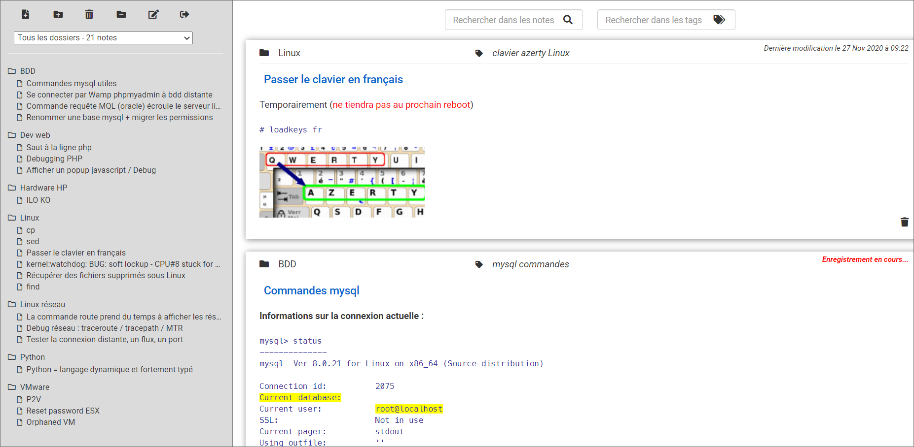
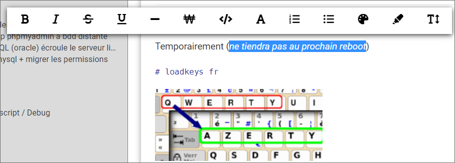

# CnoT

CnoT est une alternative open source à des applications comme Evernote. CnoT ne prétend pas être à la hauteur des fonctionnalités et de la puissance d'Evernote mais a assez de fonctionnalités pour dépanner ceux qui ne souhaitent pas dépendre d'un service en ligne.

CnoT est basée sur php, mysql et javascript.

La démonstration publique se trouve au lien suivant. Utilisez <b>"password"</b> comme mot de passe. :

[Lien vers la démonstration publique](https://cnot.fr). 

### Voici un example de mon propre CnoT :

### Possibilités de mettre en forme lorsque l'on sélectionne du texte :

## Technologies utilisées pour le développement et l'utilisation de CnoT :

* CentOS Linux release 8.2.2004 (Core)
* mysql  Ver 8.0.21 for Linux on x86_64 (Source distribution)
* Server version: Apache/2.4.37 (centos)
* PHP 7.2.24
* Google Chrome version 87.0.4280.66 (Build officiel) (64 bits)

<b>Note</b> : CnoT n'est pas fait pour être responsive. Il est adapté aux écrans d'ordinateurs.

## Installation :

1. Téléchargez les sources de CnoT sur ce repository Github sur votre serveur compatible php-mysql.
2. Cette application écrit les notes dans des fichiers, assurez-vous de fournir les autorisations nécessaires pour qu'Apache puisse lire et écrire dans le dossier nommé entries.
3. Créez votre base de donnée mysql.
4. Créez un utilisateur mysql qui aura les droits d'utiliser cette base.
5. Editez le fichier credentials.php pour définir vos identifiants et les informations de votre base de données.
6. Au lancement, l'application devrait créer elle-même la structure nécessaire dans la base de donnée.
7. Connectez-vous à l'adresse web de l'application et entrez votre mot de passe.

## Futurs développements :

Il manque encore des fonctionnalités. Je suis preneur de toutes aides en développement PHP et Javascript (ce ne sont pas mes compétences premières). To do list :

* Ajout d'une pièce jointe à une note
* Pouvoir créer un lien dans une note ou vers internet
* Avoir l'auto-complétion des tags lorsque l'on veut en ajouter un
* Pouvoir exporter toutes les notes depuis l'interface (car sinon il suffit de récupérer le répertoire "entries")
* Pouvoir partager une note
* ...

Pour info j'ai forké depuis le github suivant mais ce projet n'est plus mis à jour depuis 6 ans et la démo publique n'est plus accessible.

https://github.com/arkanath/SleekArchive 
